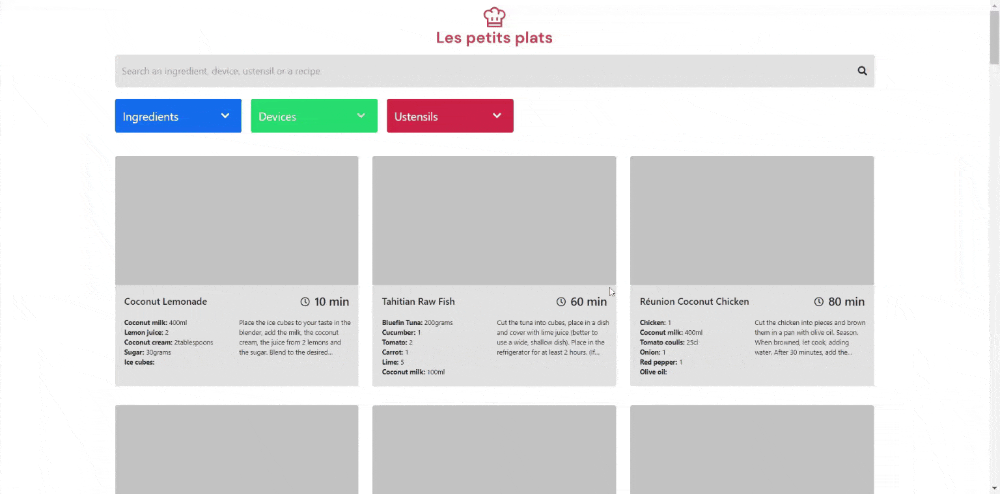

<h1 align="center">
</h1>

<h3 align="center">A recipe search tool with the aim of being the fastest of it's kind</h3>

>## **In a few words**
This search tool allows users to search recipes quickly using the main search bar or the advanced search bars.

Users can then refine their search further using the advanced search bars to filter the updated search outputs.

>## **Key requirements for the project**
1. Then appearance and structure should be done using only BootStrap and some personal CSS overrides.

2. Main search field should update the whole recipe results on every keypress once the field contains et least three characters.

3. The results present in the advanced search dropdowns should update with every new character entered in the advanced search fields.

4. Clicking on an element in the advanced search dropdown will add the item as a selected tag and filter the recipes results accordingly.

>## **Goals of this project**
* Help impliment newly acquired knowledge in **BootStrap**
* To understand layouts and customisation through **Bootstrap**
* Improve knowledge and understanding of **JavaScript** algorithms
* Learn about functionality investigation forms and comparing algorithms for chosing the best possible options

>## **Challenges faced**
* BootStrap while being simple to implement in it's basic form, is also very limiting and time consuming to fight those limitations.

>## **Goals achieved?**

Absolutely 100%
